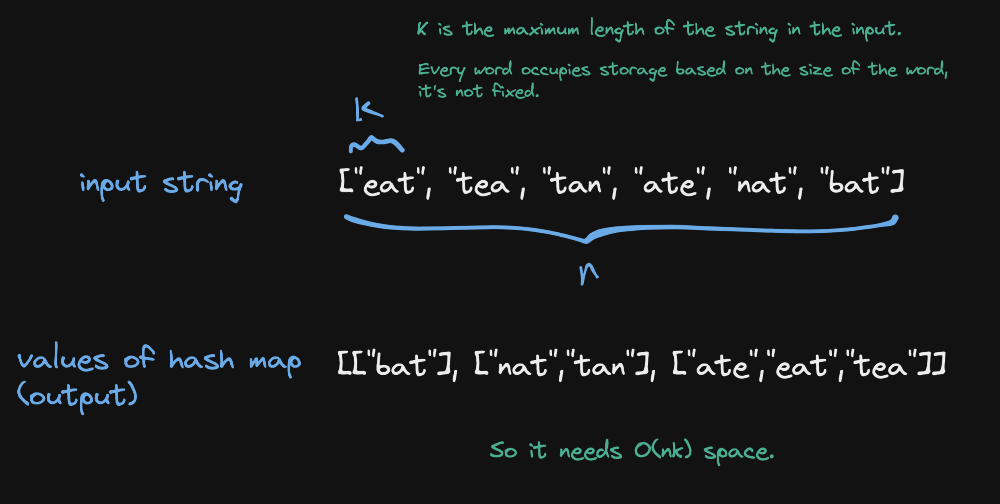

# 49. Group Anagrams

## Description

Given an array of strings `strs`, group the anagrams together.

## Constraints

- You can return the anwser in any order.
- `1 <= strs.length <= 10^4`
- `0 <= strs[i].length <= 100`
- `strs[i]` consists of lowercase English letters.

## Approach: Hash Map

```python
# python3

# time complexity: O(n * klogk), where k is the maximum length of a string in the input list.

# space complexity: O(n * k)

class Solution:
    def groupAnagrams(self, strs: List[str]) -> List[List[str]]:

        hashmap = {}

        for s in strs:
            key = tuple(sorted(s))

            if key not in hashmap:
                hashmap[key] = [s]
            else:
                hashmap[key].append(s)

        return hashmap.values()
            
```

**The diagram explaination of space complexity**

<br/>