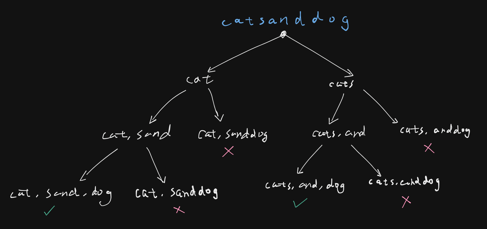
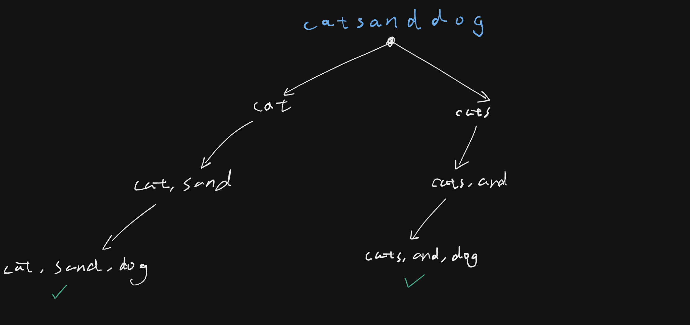

# 140. Word Break II

## Description

Given a string `s` and a dictionary of strings `wordDict`, add spaces in `s` to construct a sentence where each word is a valid dictionary word.

Return all the possible sentences in any order.

Note that the same word in the dictionary may be reused multiple times in the segmentation.

Example:
```python
Input: s = "catsanddog", wordDict = ["cat","cats","and","sand","dog"]
Output: ["cats and dog","cat sand dog"]
```

## Constraints

- `1 <= s.length <= 20`
- `1 <= wordDict.length <= 1000`
- `1 <= wordDict[i].length <= 10`
- `s` and `wordDict[i]` consist of only lowercase English letters.
- All the strings of `wordDict` are unique.

## Approach: Backtracking

<br/>
<br/>

The actual backtracking tree:

<br/>

```python
# python3

# n - the length of the string s
# w - the number of the word in the wordDict

# Time Complexity: ?
# Space Complexity: ?

class Solution:
    def wordBreak(self, s: str, wordDict: List[str]) -> List[str]:

        ans = []
        path = []

        def backtrack(start: int):
            if "".join(path) == s:
                ans.append(" ".join(path))

            if start == len(s):
                return

            for end in range(start + 1, len(s) + 1):
                segment = s[start: end]
                if segment in wordDict:
                    path.append(segment)
                    backtrack(end)
                    path.pop()

        backtrack(0)
        return ans
```