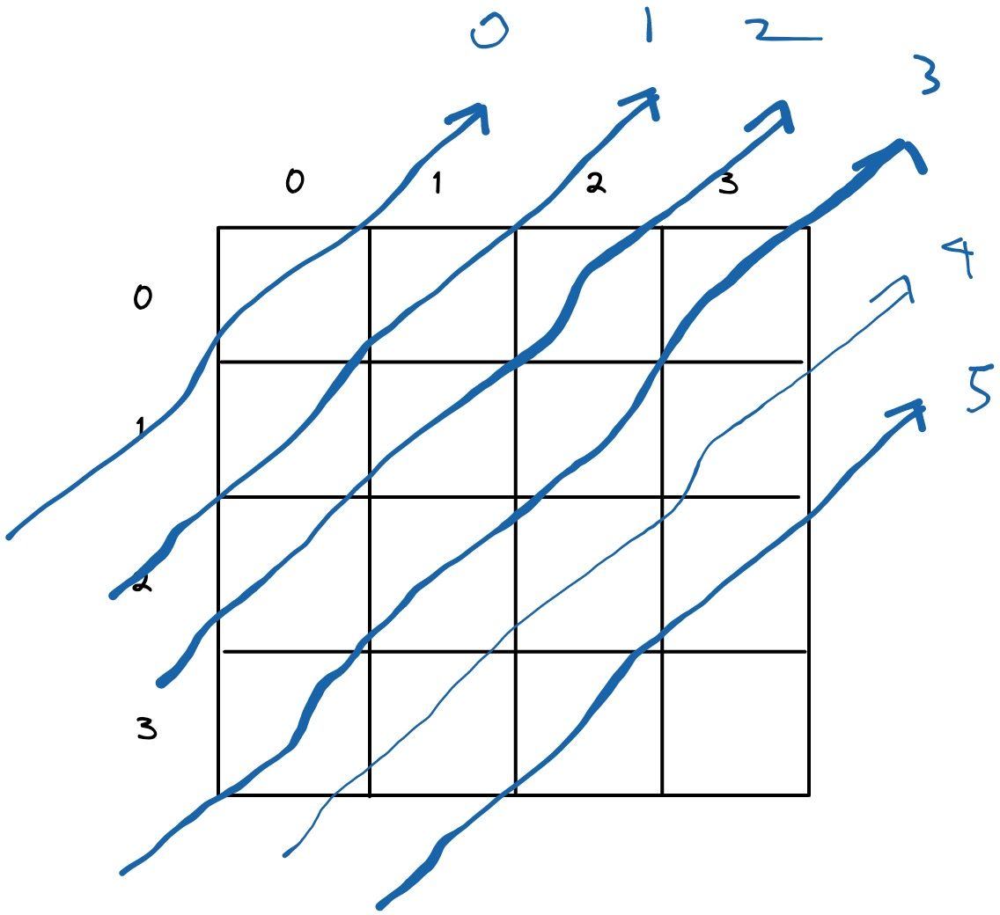
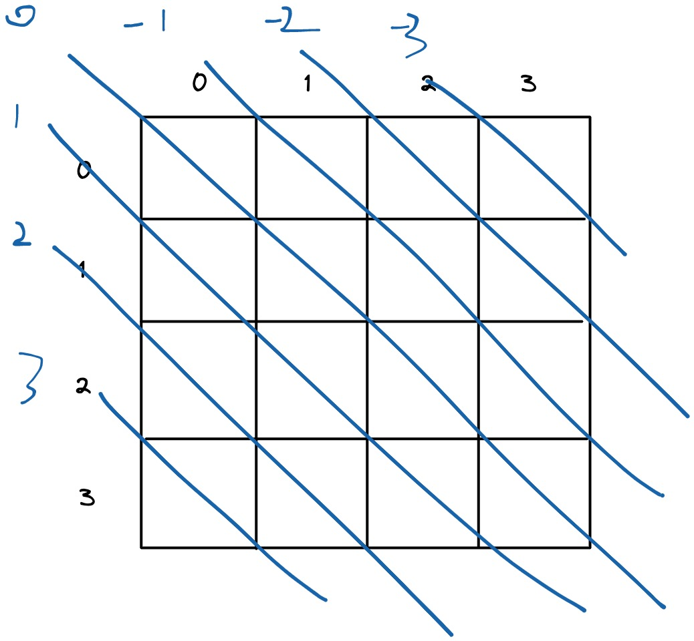

# 51. N-Queens

## Description

The n-queens puzzle is the problem of placing `n` queens on an `n×n` chessboard such that no two queens attack each other.

The way a queen can move is that a queen is allowed to move in any direction horizontally (4 directions). It can move to the left or to the right. It can move up or down. And a queen also can move diagonally (positive diagonal and negative diagonal).

Given an integer `n`, return all **distinct solutions** to the n-queens puzzle.

## Constraints

- You may return the anwser **in any order**.

- `1 <= n <= 9`

## Approach
- Choice

    We can place character `Q` in any cell of the chessboard.

- Constraints

    Each queen is in a different row.

    Each queen is in a different column.

    Each queen is in a separate positive diagonal.

    Each queen is in a separate negative diagonal.

    The pattern that we compute the indices for positive diganoal and negative diagnoal:

    1. positive diganoal index: (row + col)

        <br/>

    2. negative diagonal index: (row - col)

        <br/>

- Goals

    The recursion function reaches out to the boundary of row in chessboard.


```python
# python3

# time complexity: O(n!)
# space complexity: O(n^2)

class Solution:
    def solveNQueens(self, n: int) -> List[List[str]]:

        # the track of the place where we place a queen
        col = set()
        posDiag = set()
        negDiag = set()

        res = []
        board = [["."] * n for _ in range(n)]

        def backtrack(r):
            if r == n:
                copy = ["".join(row) for row in board]
                res.append(copy)
                return

            for c in range(n):
                if c in col or (r + c) in posDiag or (r - c) in negDiag:
                    continue

                col.add(c)
                posDiag.add(r + c)
                negDiag.add(r - c)
                board[r][c] = "Q"

                backtrack(r + 1)

                col.remove(c)
                posDiag.remove(r + c)
                negDiag.remove(r - c)
                board[r][c] = "."

        backtrack(0)
        return res
```