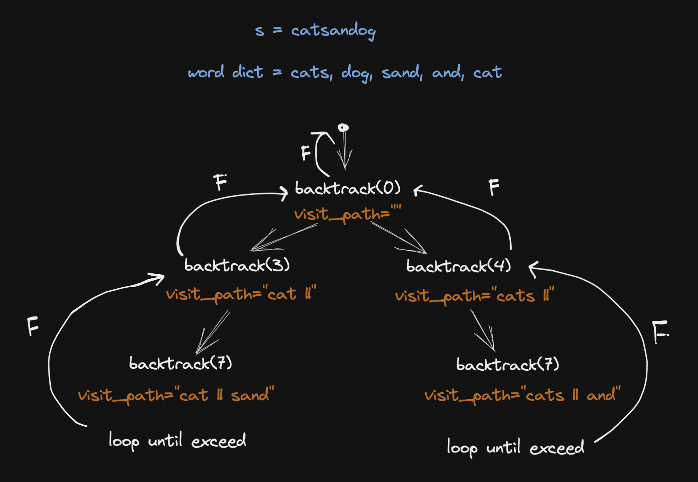

# 139. Word Break

## Description

Given a string `s` and a dictionary of strings `wordDict`, return `true` if `s` can be segmented into a space-separated sequence of one or more dictionary words.

## Constraints

- `1 <= s.length <= 300`
- `1 <= wordDict.length <= 1000`
- `1 <= wordDict[i].length <= 20`
- `s` and `wordDict[i]` consist of only lowercase English letters.
- All the strings of `wordDict` are unique.

## Approach 1: Backtracking (Time Limit Exceeded)

Use backtracking to get all the possibilities of the prefix of a substring.

<br/>
<br/>

```python

# python3

# time complexity: O(2^n)
# space complexity: O(1)

class Solution:
    def wordBreak(self, s: str, wordDict: List[str]) -> bool:

        n = len(s)

        def backtrack(start: int) -> bool:
            if start == n:
                return True

            for end in range(start + 1, n + 1):
                if s[start: end] in wordDict:
                    
                    # save the current value of start
                    currStart = start
                    start = end

                    if backtrack(start):
                        return True

                    # when the backtrack function returns
                    # we reset the start to the origin value in which we pass as the function parameter
                    start = currStart

            return False

        return backtrack(0)
```

## Approach 2: Backtracking and Dynamic Programming

<br/>
<br/>

```python

# python3

# time complexity: O(n^3)
# space complexity: O(1)

class Solution:
    def wordBreak(self, s: str, wordDict: List[str]) -> bool:

        n = len(s)

        @lru_cache
        def backtrack(start: int) -> bool:
            if start == n:
                return True

            for end in range(start + 1, n + 1):
                if s[start: end] in wordDict:
                    
                    currStart = start
                    start = end

                    if backtrack(start):
                        return True

                    # when the backtrack function returns
                    # we reset the start to the origin value in which we pass as the function parameter
                    start = currStart

            return False

        return backtrack(0)
```