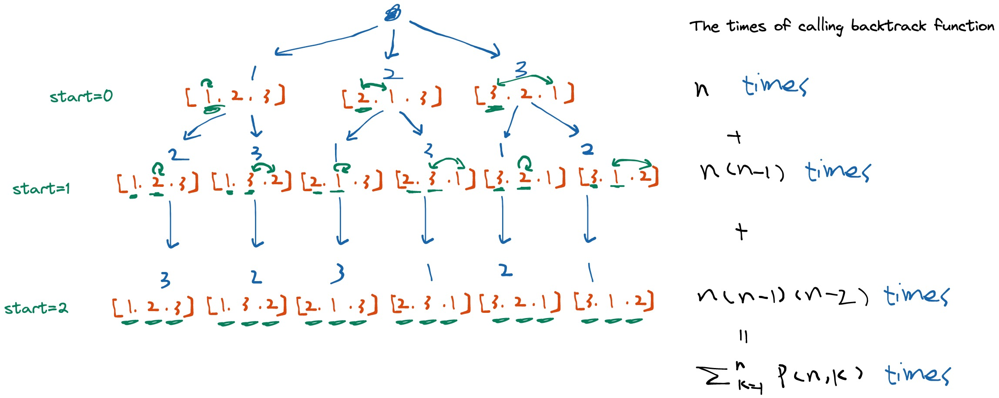

# 46. Permutations

## Description

Given an array `nums` of distinct integers, return all the possible permutations.

You can return the anwser in any order.

## Constraints

- `1 <= nums.length <= 6`
- `-10 <= nums[i] <= 10`
- All the integers of nums are unique.

## Approach: Backtracking

<br/>
<br/>

```python
# python3

# time complexity: O(∑P(N,k)) k: 1--> N
# the algorithm performs better than O(N×N!) and a bit slower than O(N!)

# space complexity: O(N!)
# the output list contains N! possible permutations

class Solution:
    def permute(self, nums: List[int]) -> List[List[int]]:

        n = len(nums)

        ans = []
        # record the recursion path
        permutation = []

        def swap(i, j):
            if i == j:
                return
            temp = nums[i]
            nums[i] = nums[j]
            nums[j] = temp

        def backtrack(start: int, permutation: List[int]):
            # if all integers are used up
            if start == n:
                ans.append(permutation[:])
                return
            
            for i in range(start, n):
                # place i-th integer first in the current position 'start'
                permutation.append(nums[i])
                swap(start, i)

                # use next integers to complete the permutations
                backtrack(start + 1, permutation)

                # backtrack
                swap(start, i)
                permutation.pop()


        backtrack(0, permutation)
        return ans

```