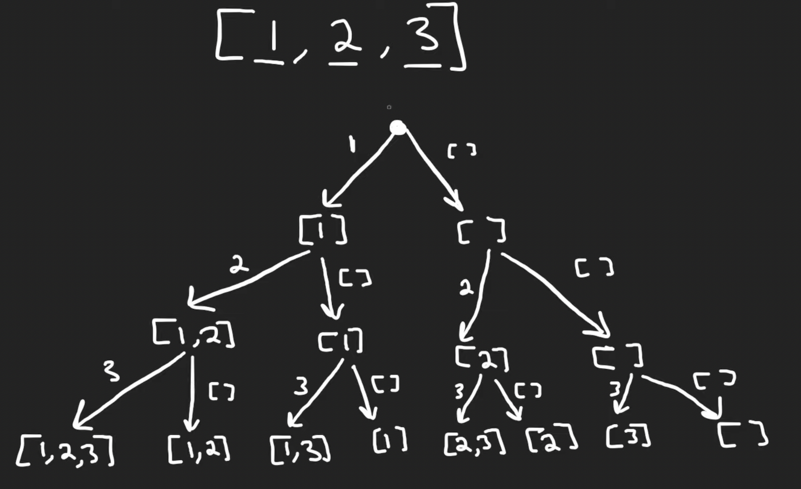

# 78. Subsets

## Description

Given an array of unique elements, return all possible subsets.

## Constraints

The solution must not contain duplicate subsets.

Return the solution in any order.

`1 <= nums.length <= 10`

`-10 <= nums[i] <= 10`

## Approach: Backtracking

<br/>
<br/>
<br/>

```python
#python3

# time complexity: O(2^n)
# space complexity: O(2^n)

class Solution:
    def subsets(self, nums: List[int]) -> List[List[int]]:

        n = len(nums)
        ans = []

        def backtrack(i = 0, subset = []):

            if i == n:
                ans.append(list(subset))
                return

            subset.append(nums[i])
            backtrack(i + 1, subset)
            subset.pop()

            backtrack(i + 1, subset)

        backtrack()
        return ans
```

## Approach: Bit Maniplution

```python
# python3

# time complexity: O(n * 2^n)
# space complexity: O(n * 2^n)

class Solution:
    def subsets(self, nums: List[int]) -> List[List[int]]:
        
        n = len(nums)
        ans = []

        for i in range(2 ** n, 2 ** (n + 1)):

            # bin(1) --> a string '0b1'
            # bin(8) --> a string '0b1000'
            # bin(8)[3:] --> a list ['0', '0', '0']
            # if n=3, generate 000 to 111
            bitmask = bin(i)[3:]

            subset = []
            for j in range(n):
                # bitmask '000' means use none of number in the array nums
                # bitmask '001' means use the number at index two
                if bitmask[j] == '1':
                    subset.append(nums[j])
            ans.append(subset)

        return ans
```