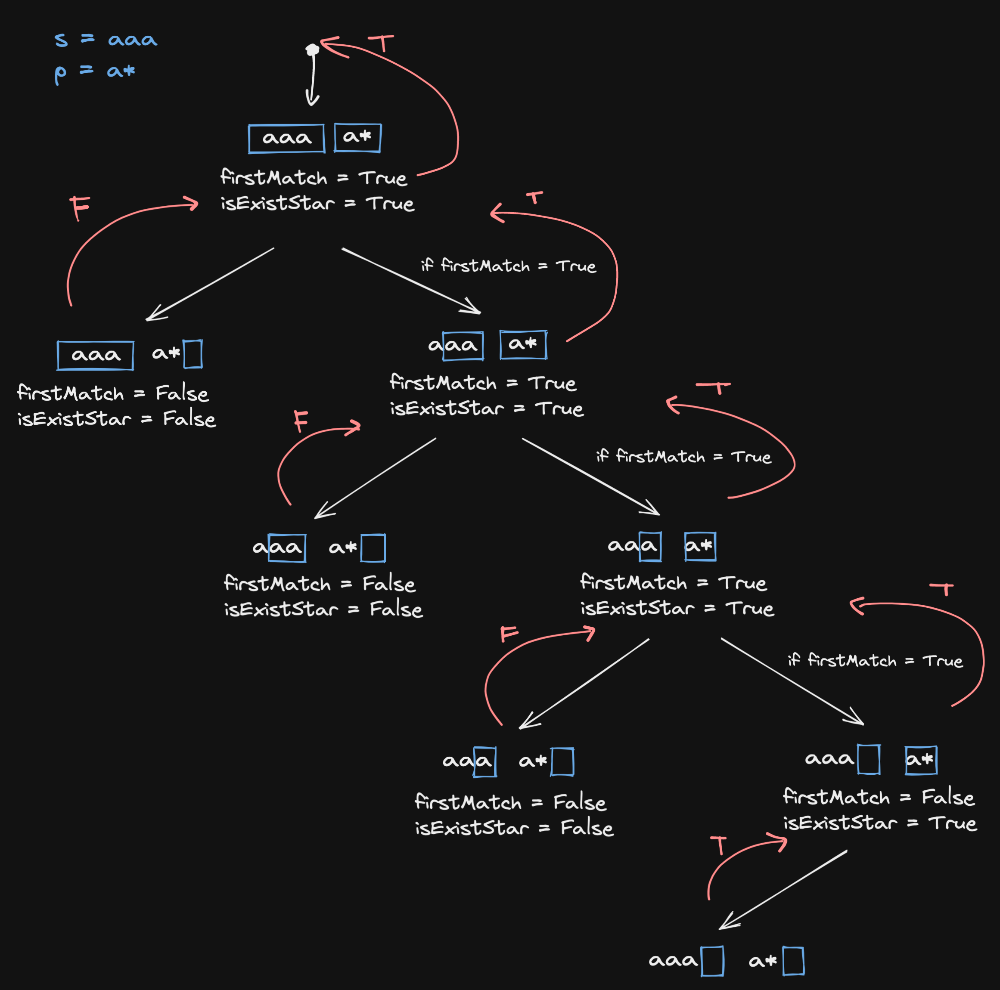

# 10. Regular Expression Matching

## Description

Given an input string `s` and a pattern `p`, implement regular expression matching with support for `'.'` and `'*'`  where:

- `'.'` Matches any single character.
- `'*'` Matches zero or more of the preceding element.

## Constraints

- The matching shoucld cover the entire input string `s` (not partial).
- `1 <= s.length <= 20`
- `1 <= p.length <= 30`
- `s` contains only lowercase English letters.
- `p` contains only lowercase English letters, `'.'`, and `'*'`.
- It is guaranteed for each appearance of the character `'*'`, there will be a previous valid character to match.

## Approach 1: Recursion (Time Limit Exceeded)

Firstly, we only consider that the regular matching algorithm only supports for `'.'` matching:
```python
# python3

class Solution:
    def isMatch(self, s: str, p: str) -> bool:
        if len(s) == 0 and len(p) == 0:
            return True

        # check if the first position of p and s respectively are matching
        if len(p) != 0 and len(s) != 0 and (p[0] == '.' or p[0] == s[0]):
            return self.isMatch(s[1:], p[1:])

        return False
```
<br/>

If a Kleene star `'*'` present in the pattern:

<br/>

```python
# python3

# n - the length of the string s

# Time Complexity: O(2^n)

class Solution:
    def isMatch(self, s: str, p: str) -> bool:
        if len(s) == 0 and len(p) == 0:
            return True

        # check if the first position of p and s respectively are matching
        firstMatch = len(p) != 0 and len(s) != 0 and (p[0] == '.' or p[0] == s[0])
        # check if a star presents in the current pattern
        isExistStar = len(p) > 1 and p[1] == '*'

        if not isExistStar:
            return firstMatch and self.isMatch(s[1:], p[1:])
        else:
            # if a star presents in the current pattern
            # we may ignore this part of the pattern : p[0:2]
            # or match the first letter of the pattern again
            ignoreFirst = self.isMatch(s, p[2:])
            notIgnoreFirst = firstMatch and self.isMatch(s[1:], p)
            return ignoreFirst or notIgnoreFirst
```

## Approach 2: Dynamic Programming(Top-Down)

```python
# python3

# n - the length of the string s
# m - the length of the string p

# Time Complexity: O(mn)
# Space Complexity: O(mn)

class Solution:
    def isMatch(self, s: str, p: str) -> bool:
        memo = {}

        def dp(i,j) -> bool:
            ans = False
            if (i, j) not in memo:
                if i == len(s) and j == len(p):
                    ans = True
                else:
                    firstMatch = j != len(p) and i != len(s) and (p[j] == '.' or s[i] == p[j])
                    isExistStar = j + 1 < len(p) and p[j + 1] == '*'

                    if not isExistStar:
                        ans = firstMatch and dp(i + 1, j + 1)
                    else:
                        ignoreFirst = dp(i, j + 2)
                        notIgnoreFirst = firstMatch and dp(i + 1, j)
                        ans = ignoreFirst or notIgnoreFirst
                
                memo[i, j] = ans
            
            return memo[i, j]

        return dp(0, 0)
```