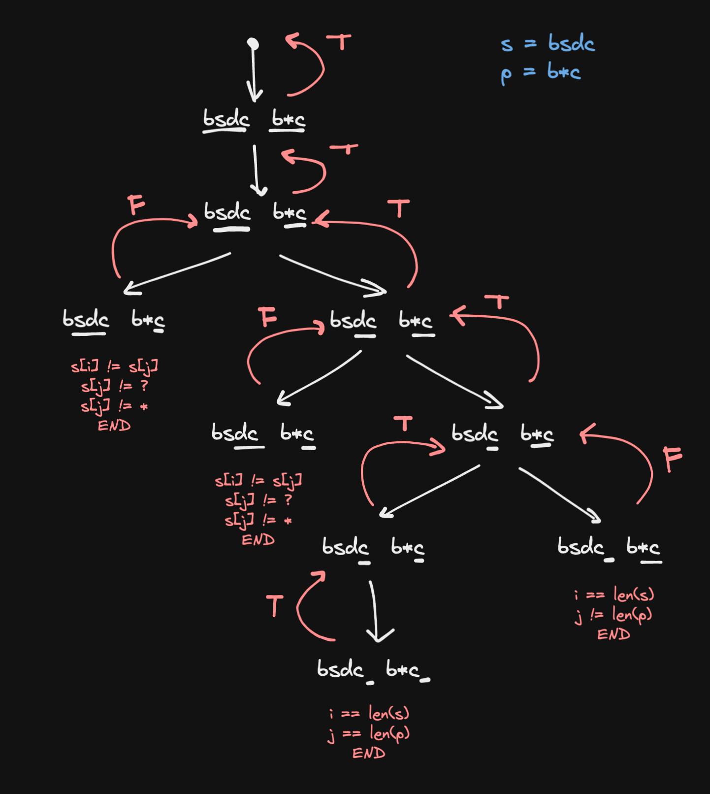
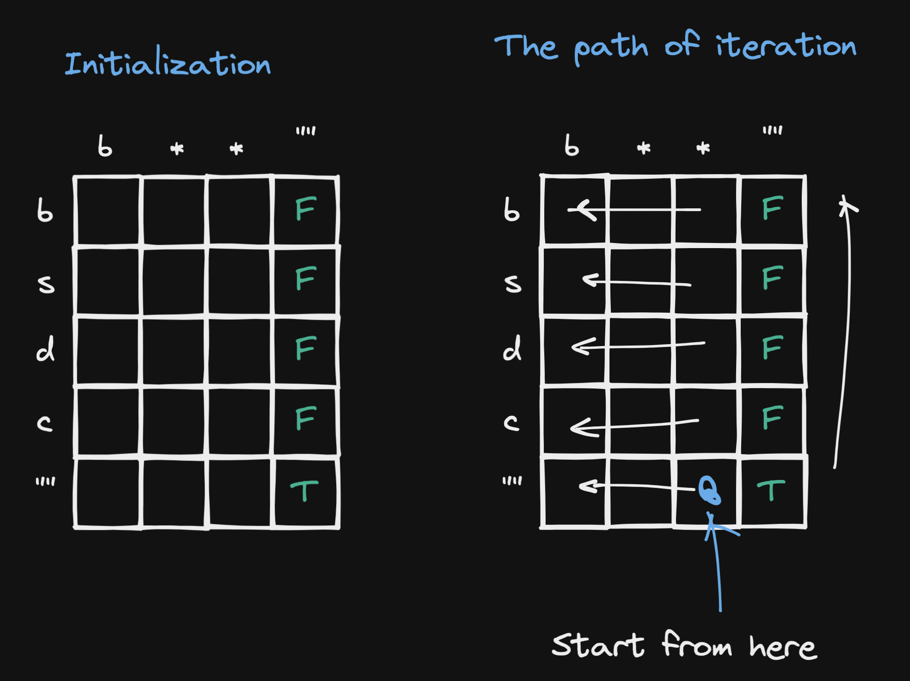
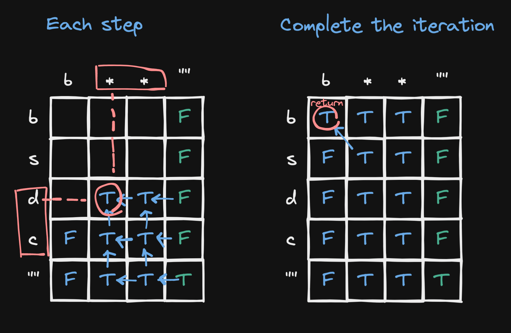

# 44. Wildcard Matching

## Description

Given an input string `s` and a pattern `p`, implement wildcard pattern matching with support for `'?'` and `'*'` where:

- `'?'` Matches any single character.
- `'*'` Matches any sequence of characters (including the empty sequence).

## Constraints

- The matching should cover the entire input string (not partial).
- `0 <= s.length, p.length <= 2000`
- `s` contains only lowercase English letters.
- `p` contains only lowercase English letters, `'?'` or `'*'`.

## Approach 1: Dynamic Programming (Top-Down)(Time Limit Exceeded)

<br/>

```python
# python3

class Solution:
    def isMatch(self, s: str, p: str) -> bool:

        @lru_cache
        def dp(i, j) -> bool:
            ans = False
            if i == len(s) and j == len(p):
                ans = True
            else:
                firstMatch = i < len(s) and j < len(p) and (p[j] == '?' or s[i] == p[j])
                isStart = j < len(p) and p[j] == '*'

                if isStart:
                    ignore = j < len(p) and dp(i, j + 1)
                    doNotIgnore = i < len(s) and dp(i + 1, j)
                    ans = ignore or doNotIgnore
                else:
                    ans = firstMatch and dp(i + 1, j + 1)

            return ans

        return dp(0,0)
```

## Approach 2: Dynamic Programming (Bottom-Up)

<br/>
<br/>

```python
# python3

# n - the length of the string s
# m - the length of the string p

# Time Complexity: O(nm)
# Space Complexity: O(nm)

class Solution:
    def isMatch(self, s: str, p: str) -> bool:
        ns, np = len(s), len(p)

        dp = [[False for _ in range(np + 1)] for _ in range(ns + 1)]

        # initialize the state
        for i in range(ns):
            dp[i][-1] = False

        dp[-1][-1] = True

        for j in range(np - 1, -1, -1):
            if p[j] == '*':
                dp[-1][j] = dp[-1][j + 1]


        for i in range(ns - 1, -1, -1):
            for j in range(np - 1, -1, -1):
                if s[i] == p[j] or p[j] == '?':
                    dp[i][j] = dp[i + 1][j + 1]
                elif p[j] == '*':
                    dp[i][j] = dp[i][j + 1] or dp[i + 1][j]
                else:
                    dp[i][j] = False

        return dp[0][0]
```