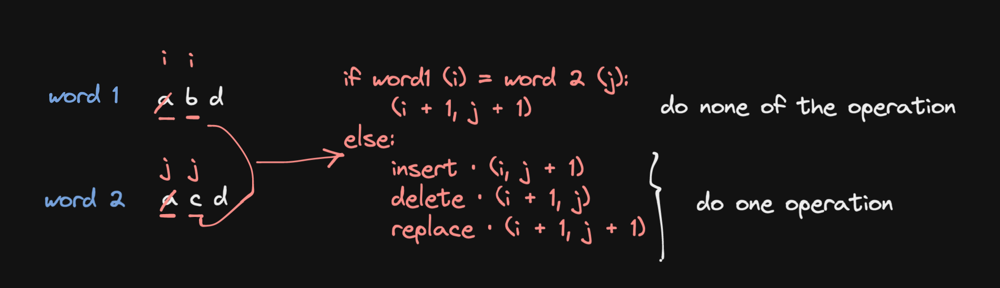
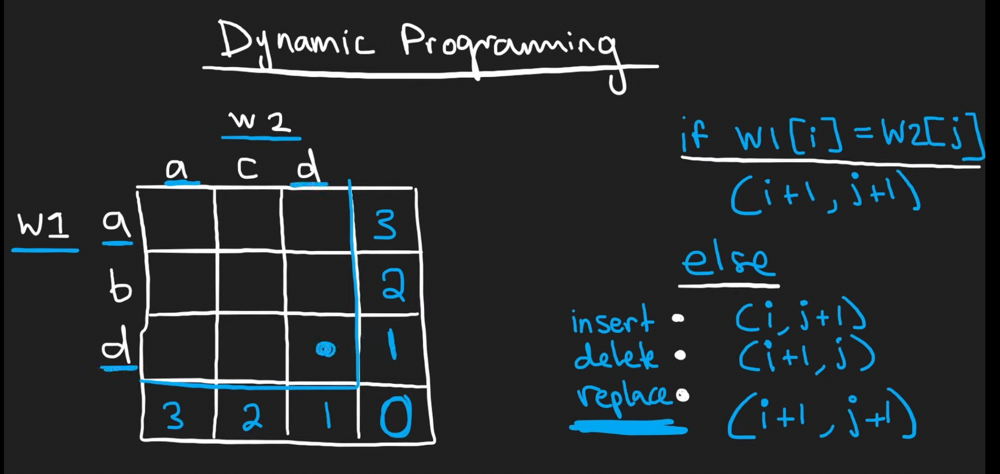

# 72. Edit Distance

## Description

Given two strings `word1` and `word2`, return the minimum number of operations required to convert `word1` to `word2`.

You have the following three operations permitted on a word:
- Insert a character
- Delete a character
- Replace a character

example:
```
Input: word1 = "horse", word2 = "ros"
Output: 3
Explanation: 
horse -> rorse (replace 'h' with 'r')
rorse -> rose (remove 'r')
rose -> ros (remove 'e')
```

## Constraints

- `0 <= word1.length, word2.length <= 500`
- `word1` and `word2` consist of lowercase English letters.

## Approach

<br/>
<br/>

<br/>
<br/>

```python
# python3

# time complexity: O(mn)
# space complexity: O(mn)

class Solution:
    def minDistance(self, word1: str, word2: str) -> int:

        m, n = len(word1), len(word2)

        if m == 0 : return n # "" vs "abc"
        if n == 0 : return m # "abc" vs ""
        if word1 == word2: return 0 # "abc" vs "abc"

        dp = [[0 for _ in range(n + 1)] for _ in range(m + 1)]
        # initialize the dp
        for i in range(m + 1):
            dp[i][n] = m - i
        for j in range(n + 1):
            dp[m][j] = n - j

        for i in range(m - 1, -1, -1):
            for j in range(n - 1, -1, -1):
                # the characters we're comparing are equal
                if word1[i] == word2[j]:
                    dp[i][j] = dp[i + 1][j + 1]
                # the character we're comparing are not equal
                # then we can insert(left), delete(down), or replace(diagonal) the current character of word1
                # choose the minimum one
                else:
                    dp[i][j] = 1 + min(dp[i][j + 1], dp[i + 1][j], dp[i + 1][j + 1])

        return dp[0][0]
```