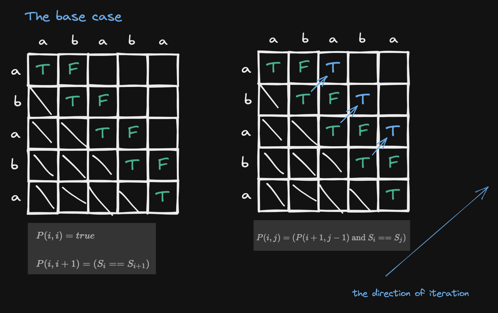

# 5. Longest Palindromic Substring

## Description

Given s string `s`, return the longest palindromic substring in `s`.

## Constraints

- `1 <= s.length <= 1000`
- `s` consist of only digits and English letters.

## Approach: Dynamic Programming

<br/>

```python
# python3

# Time Complexity: O(n^2)
# Space Complexity: O(n^2)

class Solution:
    def longestPalindrome(self, s: str) -> str:
        n = len(s)

        dp = [[False for _ in range(n)] for _ in range(n)]

        ans = s[0]

        for d in range(n):
            for i in range(0, n - d):
                j = i + d
                if j == i:
                    dp[i][i] = True
                elif j == i + 1:
                    dp[i][j] = (s[i] == s[j])
                else:
                    dp[i][j] = dp[i + 1][j - 1] and (s[i] == s[j])

                if dp[i][j] == True and len(ans) < (j - i + 1):
                    ans = s[i: j + 1]

        return ans
        
```