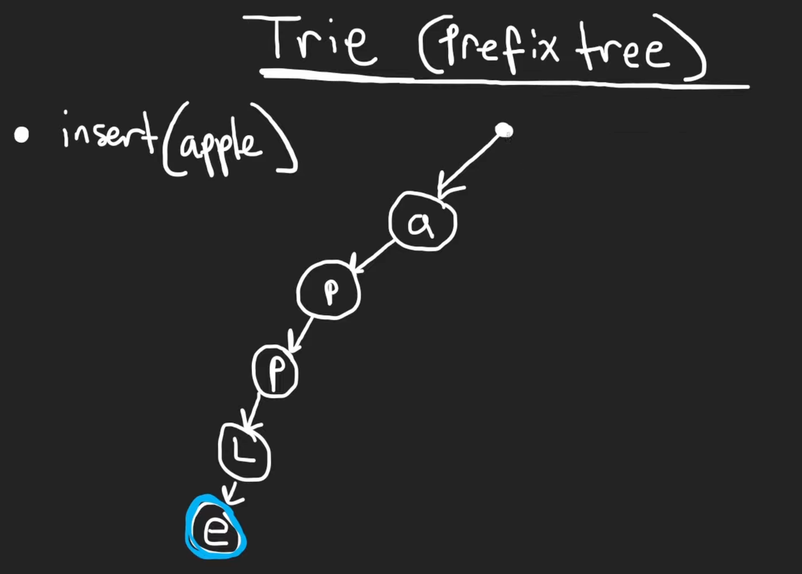

# 208. Implement Trie (Prefix Tree)

## Description

- `Trie()` Initializes the trie object.
- `void insert(String word)` Inserts the string `word` into the trie.
- `boolean search(String word)` Returns `true` if the string `word` is in the trie (i.e., was inserted before), and `false` otherwise.
- `boolean startsWith(String prefix)` Returns `true` if there is a previously inserted string `word` that has the prefix `prefix`, and `false` otherwise.

Example:
```python
Input
["Trie", "insert", "search", "search", "startsWith", "insert", "search"]
[[], ["apple"], ["apple"], ["app"], ["app"], ["app"], ["app"]]
Output
[null, null, true, false, true, null, true]

Explanation
Trie trie = new Trie();
trie.insert("apple");
trie.search("apple");   // return True
trie.search("app");     // return False
trie.startsWith("app"); // return True
trie.insert("app");
trie.search("app");     // return True
```

## Constraints

- `1 <= word.length, prefix.length <= 2000`
- `word` and `prefix` consist only of lowercase English letters.
- At most `3 * 104` calls in total will be made to `insert`, `search`, and `startsWith`.

## Approach

<br/>
<br/>

```python
# python3

class TrieNode:

    def __init__(self):
        # children['a'] --> another trie node
        self.children = {}
        self.endOfWord = False


class Trie:

    def __init__(self):
        self.root = TrieNode()
        
    # time complexity: O(n)
    # space complexity: O(n)
    def insert(self, word: str) -> None:
        cur = self.root

        for ch in word:
            # if the character doesn't exist
            if ch not in cur.children:
                cur.children[ch] = TrieNode()
            
            cur = cur.children[ch]

        cur.endOfWord = True
        

    # time complexity: O(n)
    # space complexity: O(1)
    def search(self, word: str) -> bool:
        cur = self.root
        
        for ch in word:
            # if the character does not exist
            if ch not in cur.children:
                return False
            # if the character exists, the entire loop will keep executing
            cur = cur.children[ch]
        
        return cur.endOfWord
        

    # time complexity: O(n)
    # space complexity: O(1)
    def startsWith(self, prefix: str) -> bool:
        cur = self.root

        for ch in prefix:
            if ch not in cur.children:
                return False
            cur = cur.children[ch]

        return True
```