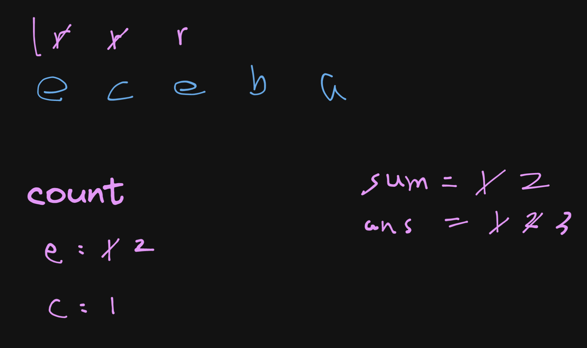

# 340. Longest Substring with At Most K Distinct Characters

## Description

Given a string `s` and an integer `k`, return the length of the longest substring of `s` that contains at most `k` distinct characters.

## Constraints

- 1 <= s.length <= 5 * 10^4
- 0 <= k <= 50

## Approach: Sliding Window and Hash Map

<br/>

```python
# python3

# time complexity: O(n)
# space complexity: O(k)

class Solution:
    def lengthOfLongestSubstringKDistinct(self, s: str, k: int) -> int:
        count = {}
        ans = 0

        l = 0
        for r in range(len(s)):
            ch = s[r]
            count[ch] = 1 + count.get(ch, 0)

            while len(count) > k:
                if count[s[l]] > 1 : count[s[l]] -= 1
                else: del count[s[l]]
                l += 1

            if len(count) <= k:
                ans = max(ans, r - l + 1)

        return ans
```