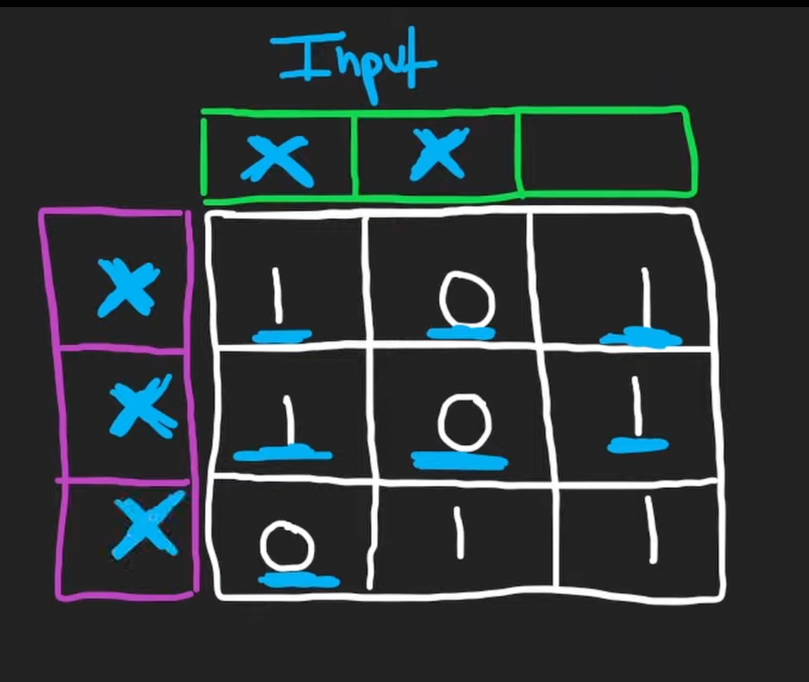

# 73. Set Matrix Zeroes

## Description

Gievn you an `m*n` matrix `matrix`, if a element is `0`, set its entire column's and row's value to `0`.


## Approach 1: Addtional Memory Approcah
<br/>


<br/>

```python
# python3

class Solution:
    def setZeroes(self, matrix: List[List[int]]) -> None:
        """
        Do not return anything, modify matrix in-place instead.
        """
        # array for number of row to mark the row we want to fill with zero
        row_zero = []
        # array for number of column to mark the column we want to fill with zero
        col_zero = []

        m, n = len(matrix), len(matrix[0])
        # iterate every single value in the matrix
        # to store the column and row of zero value
        for i in range(0, m):
            for j in range(0, n):
                if matrix[i][j] == 0:
                    if i not in row_zero: row_zero.append(i)
                    if j not in col_zero: col_zero.append(j)

        for row in row_zero:
            for j in range(0, n):
                matrix[row][j] = 0

        for col in col_zero:
            for i in range(m):
                matrix[i][col] = 0

        # the time complexity: O(mn)
        # the worst space comlexity: O(m + n)

```