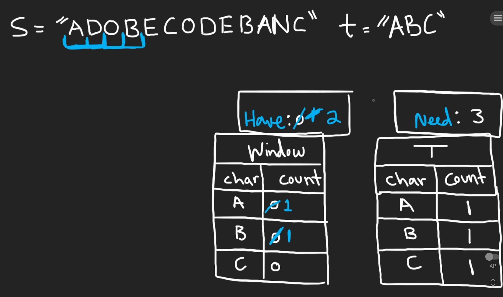

# 76. Minimum Window Substring

## Description

Given two string `s` and `t` of lengths `m` and `n` respectively, return the minimum window substring of `s` such that every character in `t` (including duplicates) is included in the window. If there is no such substring, return the empty string `""`.

The testcase will be generated such that the anwser is unique.

## Constraints

- `s` and `t` consist of uppercase and lowercase English letters.
- `m == s.length`
- `n == t.length`
- `1 <= m, n <= 10^5`

## Approach 1: Brute Force (Time Limit Exceeded)

```python
# python3

# time complexity: O(n^2)
# space complexity: O(n)

from collections import Counter

class Solution:
    def minWindow(self, s: str, t: str) -> str:

        ans = ""
        m, n = len(s), len(t)
        # the edge case
        if m < n: return ans

        tCount = Counter(t)

        def find(start: int) -> int:
            sCount = Counter()
            for i in range(start, m):
                if s[i] in tCount and tCount[s[i]] > sCount[s[i]]:
                    sCount[s[i]] = 1 + sCount.get(s[i], 0)
                if sCount == tCount:
                    return i
            # there is no substring
            return -1
        
        minWindowLen = math.inf
        for left in range(m):
            if s[left] in tCount:
                # expand the sliding window to satisfy the condition
                right = find(left)
                # comparison
                if right >= 0:
                    if right - left + 1 < minWindowLen:
                        ans = s[left: right + 1]
                        minWindowLen = right - left + 1

        return ans
```

## Approach 2

<br/>
<br/>

```python
# python3

# time complexity: O(n)
# space complexity: O(n)

class Solution:
    def minWindow(self, s: str, t: str) -> str:

        ans = ""
        m, n = len(s), len(t)

        # the edge case
        if m < n:
            return ans

        window = {}
        tCount = {}

        for ch in t:
            tCount[ch] = 1 + tCount.get(ch, 0)

        have, need = 0, len(tCount)
        minWindowLen = math.inf
        left = 0
        for right in range(m):
            ch = s[right]

            # update window
            # if the current character is included in the targer string
            # then add it to the window counter
            if ch in tCount:
                window[ch] = 1 + window.get(ch, 0)
                # check if it satisfies the condition that the occurrence number of a character in window is equal to the number of the character in the string 't'
                if window[ch] == tCount[ch]:
                    have += 1

            # do the comparison and updating
            while have == need:
                # (have == need) statement means we find out the one of the anwsers
                # update the anwser
                if right - left + 1 < minWindowLen:
                    minWindowLen = right - left + 1
                    ans = s[left: right + 1]

                # pop from the left of our window
                if s[left] in window and s[left] in tCount:
                    window[s[left]] -= 1
                    if window[s[left]] < tCount[s[left]]:
                        have -= 1

                left += 1

        return ans
```