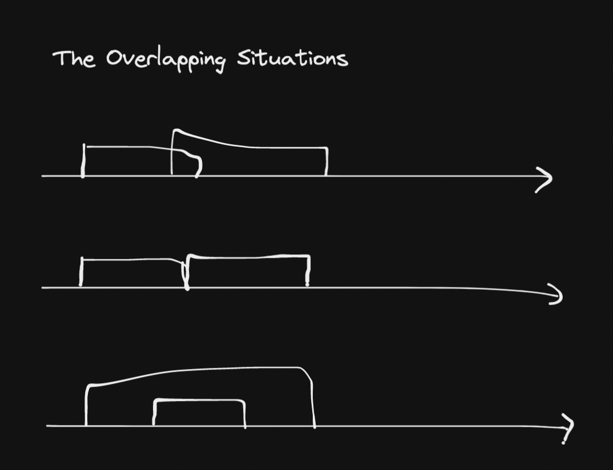

# 56. Merge Intervals

## Description

Given an array of `intervals` where `intervals[i] = [start_i, end_i]`, merge all overlapping intervals, and return an array of the non-overlapping intervals that cover all the intervals in the input.

## Constraints

- `1 <= intervals.length <= 10^4`
- `intervals[i].length == 2`
- `0 <= starti <= endi <= 10^4`

## Approach

<br/>
<br/>

```python
# python3

# time complexity: O(nlogn)
# space complexity: O(1), python sort method modifies the list in-place. 

class Solution:
    def merge(self, intervals: List[List[int]]) -> List[List[int]]:

        intervals.sort(key=lambda x : x[0])

        merged = []

        for interval in intervals:
            # if the list of merge is empty
            # or if the current interval does not overlap with the previous
            # simply append it
            if len(merged) == 0 or interval[0] > merged[-1][1]:
                merged.append(interval)
            else:
                # otherwise, there is overlap
                # so merge the current interval with the previous interval
                if interval[0] <= merged[-1][1]:
                    newStart = min(interval[0], merged[-1][0])
                    newEnd = max(interval[1], merged[-1][1])
                    merged[-1][0], merged[-1][1] = newStart, newEnd

        return merged
```