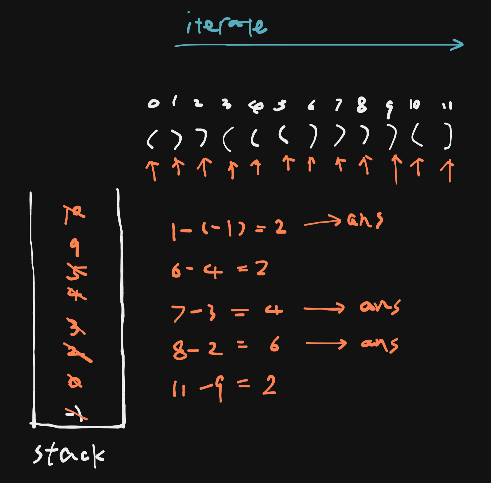

# 32. Longest Valid Parentheses

## Description

Given a string containing just the characters `(` and `)`.

Return the length of the longest valid (well-formed) parentheses substring.

## Constraints

- `0 <= s.length <= 3 * 104`
- `s[i] is '(', or ')'.`

## Approach



```python

# python3

# time complexity: O(n)
# space complexity: O(n)

class Solution:
    def longestValidParentheses(self, s: str) -> int:

        n = len(s)
        ans = 0

        stack = []
        stack.append(-1)

        for i in range(n):
            ch = s[i]
            if ch == '(':
                stack.append(i)
            elif ch == ')':
                if stack:
                    # may pop an index of '(' or ')'
                    # if pop an index of '(': current right parenthese is valid
                    # if pop an index of ')': current right parenthese is invalid
                    stack.pop()

                    if stack:
                        # count the length of the valid parentheses
                        difference = i - stack[-1]
                        ans = max(ans, difference)
                    else:
                        # add the new count boundary
                        stack.append(i)

        return ans
```