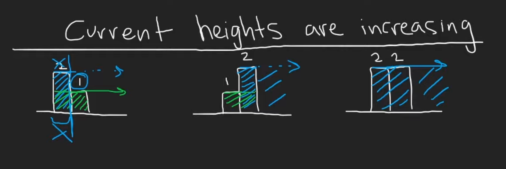
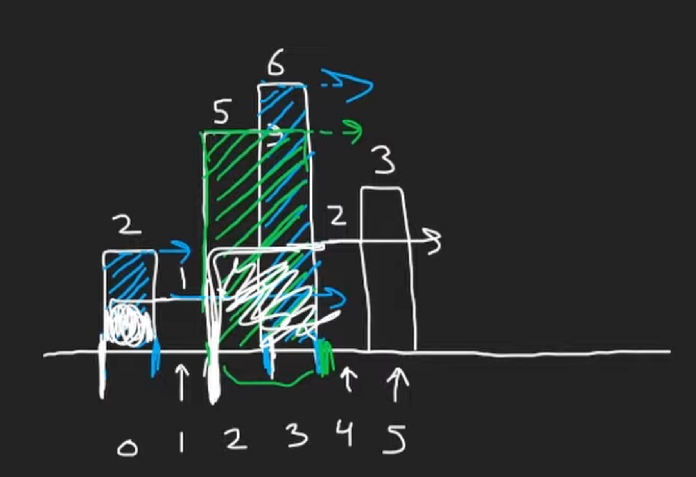
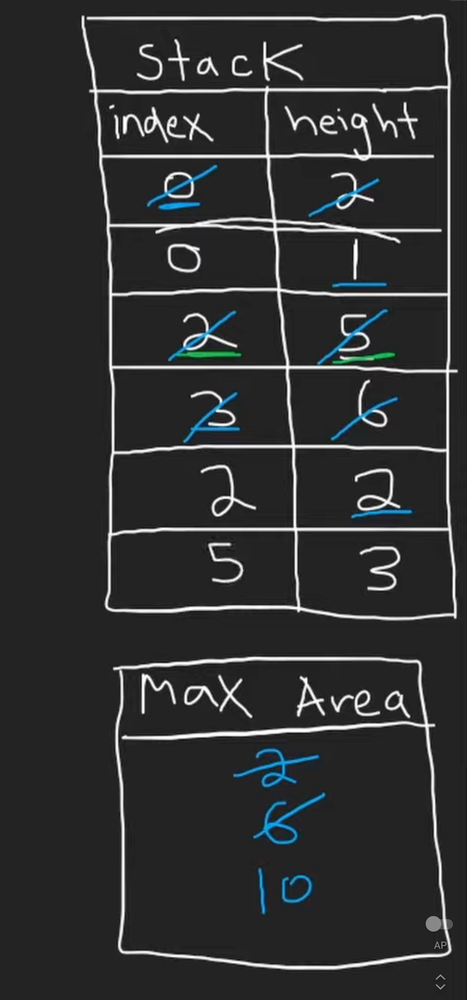

# 84. Largest Rectangle in Histogram

## Description

Given an array of integers `height` representing the histogram's bar height where the width of each bar is `1`, return the area of the largest rectangle in the histogram.

## Constraints

- `1 <= heights.length <= 105`
- `0 <= heights[i] <= 104`

## Approach: Monotonic Stack

<br/>
<br/>

<br/>
<br/>

<br/>
<br/>

```python
# python3

# time complexity: O(n)
# space complexity: O(n)

class Solution:
    def largestRectangleArea(self, heights: List[int]) -> int:
        
        n = len(heights)

        # pair: (index, height)
        stack = []
        max_area = 0

        # iterate through the index and height of the array
        for i, h in enumerate(heights):

            start = i

            # if the top value height is greater than the height we just reached
            # pop the height and check the max rectangle we can create
            while stack and h < stack[-1][1]:
                top_i, top_h = stack.pop()

                width = i - top_i
                height = top_h
                max_area = max(max_area, width * height)
                
                # we can extend our start index backward to the index we just popped
                start = top_i
                
            stack.append([start, h])

        # the element left in the stack
        # these elements are able to be extended all the way to the end of the histogram
        for i, h in stack:

            width = n - i
            height = h

            max_area = max(max_area, width * height)

        return max_area
```