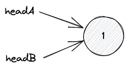
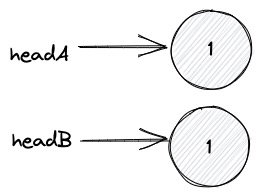

# 160. Intersection of Two Linked Lists

## Description

Given you two linked list `headA` and `headB`, return the node at which the two lists intersect.

If two lists have no intersect, return `null`.<br/>
<br/>


<br/>

## Approach: Two Pointers

Edge case 1: Two lists have intersect, but they have only one node

<br/>
<br/>

Edge case 2: Two list have no intersect

<br/>
<br/>

```python
# python3

# time complexity: O(n + m)
# space complexity: O(1)

# Definition for singly-linked list.
# class ListNode:
#     def __init__(self, x):
#         self.val = x
#         self.next = None

class Solution:
    def getIntersectionNode(self, headA: ListNode, headB: ListNode) -> Optional[ListNode]:

        # initialize pointer pa to point at headA
        # initialize pointer pb to point at headB
        pa = headA
        pb = headB

        # loop until pa and pb point to the same node
        while pa != pb:
            if pa == None:
                # if pa exceeds the boundary
                # points to headB
                pa = headB
            else:
                # if pa does not exceed the boundary
                # points to the next node
                pa = pa.next

            if pb == None:
                # if pb exceeds the boundary
                # points to headA
                pb = headA
            else:
                # if pb does not exceed the boundary
                # points to the next node
                pb = pb.next

        #if the loop breaks:
        # case 1: pa and pb point to the same node which is not None
        # example 1: headA -> 1
        #            headB    ↑

        # case 2: pa and pb point to None, return None means return False
        # example 2 (two list have no intersect):
        #           headA -> 1 -> 2
        #           headB -> 1 -> 2 -> 3
        return pa
```
