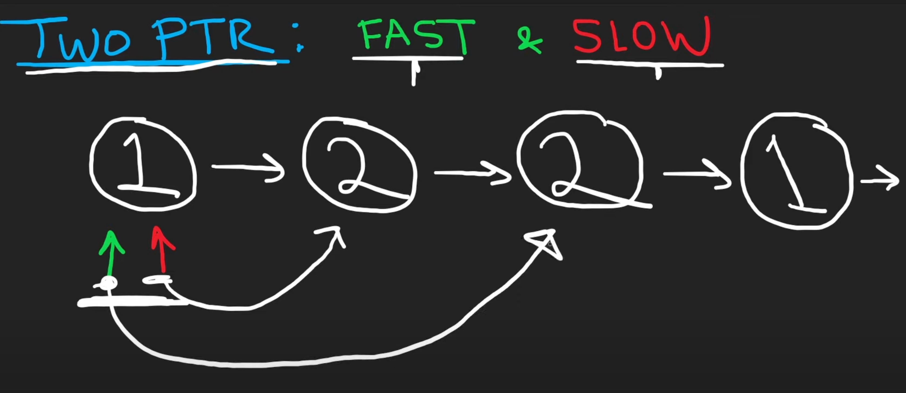
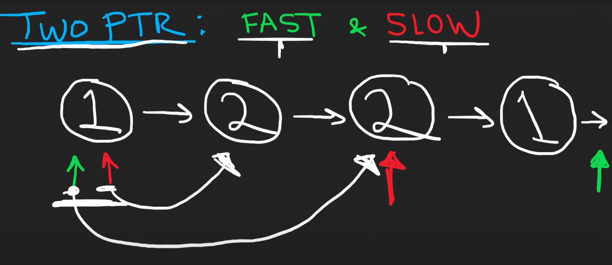
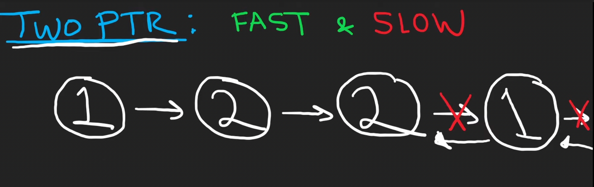
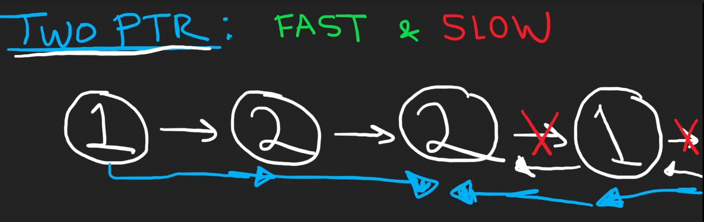

# 234. Palindrome Linked List

## Description

Given you a singly linked list, return `True` if the list is a palindrome or `False` otherwise.

## Constraints

- The number of nodes in the list is in the range`[1, 10^5]`
- `0 <= node.val <= 9`

## Approach 1
```python
# python3

# time comlexity: O(n)
# space complexity: O(n)

# Definition for singly-linked list.
# class ListNode:
#     def __init__(self, val=0, next=None):
#         self.val = val
#         self.next = next
class Solution:
    def isPalindrome(self, head: Optional[ListNode]) -> bool:
        stack = []
        
        # iterate through the list to put every node into the stack
        p = head
        while p:
            stack.append(p)
            p = p.next

        # iterate through the list again
        # at the same time, pop stack elements
        # compare the node from list and stack respectively
        cur = head
        while stack and cur:
            p = stack.pop()
            # if two nodes are different, the list is not palindrome
            if p.val != cur.val:
                return False
            cur = cur.next

        return True
```

## Approach 2 (Optimal solution)

We gonna use two pointers, one pointer calls `fast`, one pointer calls `slow`.

<br/>
<br/>

When the `fast` pointer exceeds, the `slow` pointer point at the middle of the list (right side).

<br/>
<br/>

Then we reverse the second half.

<br/>
<br/>

Then we can basically check.

<br/>
<br/>

```python
# python3

#time complexity: O(n)
#sapce complexity: O(1)

class Solution:
    def isPalindrome(self, head: Optional[ListNode]) -> bool:
 
        # initialize the fast and slow pointers
        slow, fast = head, head

        #find the middle of the list
        # actually, it is right side (one step) to the center of the list
        # 1 -> 2 -> 3, the slow points at '3' finally
        # 1 -> 2 -> 3 -> 4, the slow point at '3' finally
        while fast:
            slow = slow.next
            fast = fast.next.next if fast.next else None

        # reverse the second half
        # slow: to save the node that is currently manipulated
        # prev: to save the node which the current node points at
        # temp: to save the node next manipulated
        prev = None
        while slow:
            temp = slow.next
            slow.next = prev
            prev = slow
            slow = temp

        # after reversing, the prev will point at the head of second half list
        # if the list only has one node, the prev would be None, we won't start the loop
        left, right = head, prev
        while right:
            if left.val != right.val:
                return False
            left = left.next
            right = right.next

        return True
```