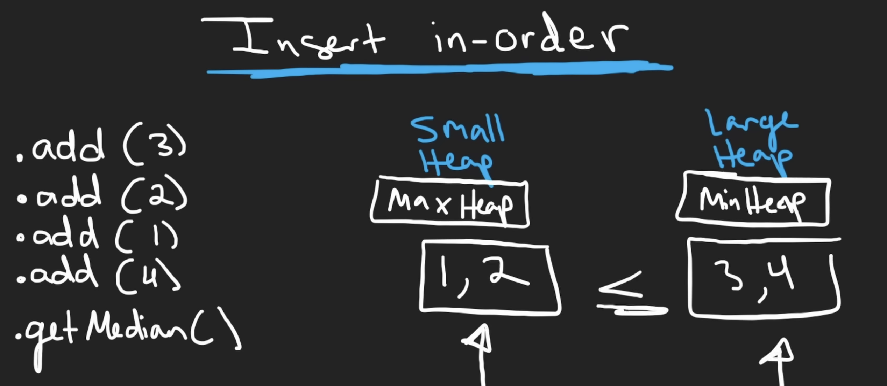
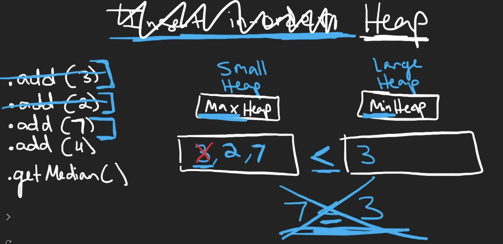

# 295. Find Median from Data Stream

## Decription

The **median** is the middle value in an ordered integer list.

## Constraints

`-105 <= num <= 105`

There will be at least one element in the data structure before calling findMedian.

At most `5 * 104` calls will be made to addNum and findMedian.

## Approach

<br/>
<br/>

We must make sure every num in small heap <= every num in larger heap:
<br/>
<br/>

```python
# python3

# time complexity: O(logn)
# space complexity: O(n)

class MedianFinder:

    def __init__(self):
        # two heap, small heap (the max heap) and larger heap (the min heap)
        # heaps should be euqal size
        self.smallHeap, self.largerHeap = [], []
        

    def addNum(self, num: int) -> None:

        # python only implements the min heap
        # but the small heap is a max heap, so each num plus a negative one
        heapq.heappush(self.smallHeap, -1 * num)

        # make sure every num in small heap <= every num in larger heap
        if self.smallHeap and self.largerHeap and (-1 * self.smallHeap[0] > self.largerHeap[0]):
            val = -1 * heapq.heappop(self.smallHeap)
            heapq.heappush(self.largerHeap, val)

        # heaps should be equal size or 'len(small heap) - len(larger heap) <= 1'
        # otherwise, we should pop the small head and push the value to the larger heap
        if len(self.smallHeap) - len(self.largerHeap) > 1:
            val = -1 * heapq.heappop(self.smallHeap)
            heapq.heappush(self.largerHeap, val)
        if len(self.largerHeap) - len(self.smallHeap) > 1:
            val = heapq.heappop(self.largerHeap)
            heapq.heappush(self.smallHeap, -1 * val)
        

    def findMedian(self) -> float:
        ans = float(0)

        smallLength = len(self.smallHeap)
        largerLength = len(self.largerHeap)

        # if the sum of size is an even number
        if smallLength == largerLength:
            ans = (-1 * self.smallHeap[0] + self.largerHeap[0]) / 2
        # if the sum of size is an odd number
        elif smallLength > largerLength:
            ans = -1 * self.smallHeap[0]
        else:
            ans = self.largerHeap[0]
        
        return ans

# Your MedianFinder object will be instantiated and called as such:
# obj = MedianFinder()
# obj.addNum(num)
# param_2 = obj.findMedian()
```