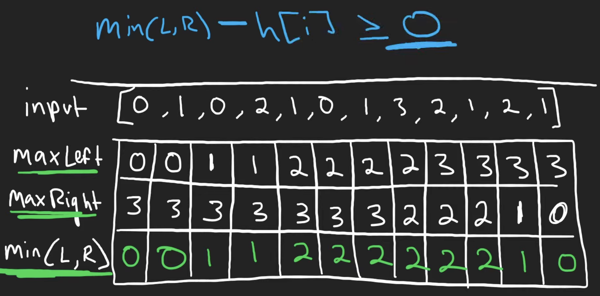
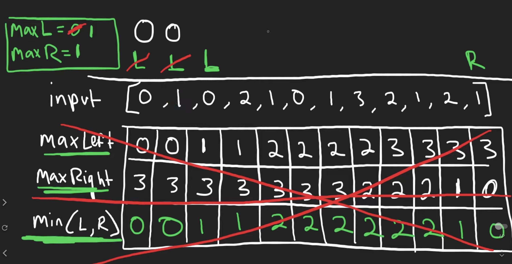

# 42. Trapping Rain Water

## Description

Given `n` non-negative representing an elevation map where the width of each bar is `1`, compute how much water it can trap after raining.


## Constraints

`n == height.length`

`1 <= n <= 2 * 104`

`0 <= height[i] <= 105`

## Approach 1

<br/>
<br/>
<br/>

```python
# python3

# time complexity: O(n)
# space complexity: O(n)

class Solution:
    def trap(self, height: List[int]) -> int:

        n = len(height)
        ans = 0

        # maxLeft[i]: the maximum height in 'i' left side
        maxLeft = [0] * n
        # maxRight[i]: the maximum height in 'i' right side
        maxRight = [0] * n

        for i in range(1, n):
            maxLeft[i] = max(height[i - 1], maxLeft[i - 1])

        for i in range(n - 2, -1, -1):
            maxRight[i] = max(height[i + 1], maxRight[i + 1])

        # count how much water each position can trap
        for i in range(0, n):
            water = min(maxLeft[i], maxRight[i]) - height[i]
            if water >= 0:
                ans += water

        return ans
```

## Approach 2 (Optimal Solution: O(1) Space Complexity)

<br/>
<br/>
<br/>

```python
# python3

# time complexity: O(n)
# space complexity: O(1)

class Solution:
    def trap(self, height: List[int]) -> int:

        n = len(height)
        ans = 0

        # initialize two pointers
        left, right = 0, n - 1

        # maxLeft: the maximum height of each position's left side
        maxLeft = height[left]
        # maxRight: the maximum height of each position's right side
        maxRight = height[right]

        # count how much water each position can trap
        while left < right:

            # decide which cell to compute and which pointer to shift
            if maxLeft <= maxRight:
                left += 1
                cur = left
            else:
                right -= 1
                cur = right

            # count the water of the current position can trap
            # we don't need to worry if the 'maxLeft' or 'maxRight' is not the largest one in left side or right side respectively
            # in previous step, we shift left and right pointers that depend on the smaller value in 'maxLeft' and 'maxRight'
            # example: if 'maxLeft < maxRight', then we can get 'maxLeft < maxRight < theRealMaxRight'
            water = min(maxLeft, maxRight) - height[cur]
            if water >= 0:
                ans += water

            # update the maximum height
            if cur == left:
                maxLeft = max(maxLeft, height[cur])
            else:
                maxRight = max(maxRight, height[cur])

        return ans


```