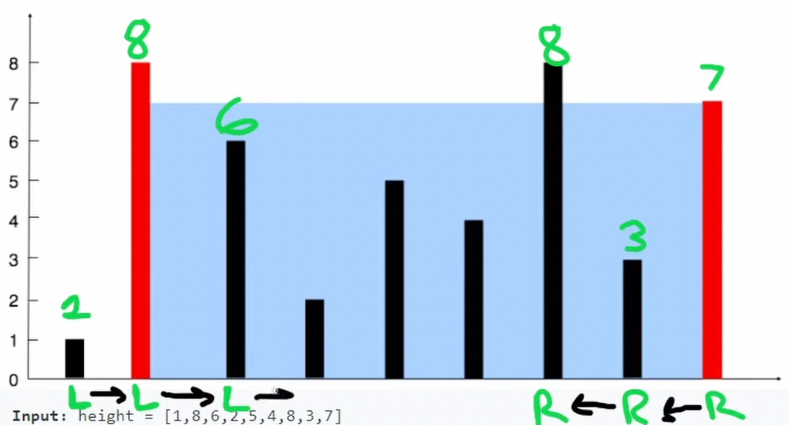

# 11. Container With Most Water

## Description

Givan an integer array `heigh` of `n`.

There're `n` vertical lines, the `i^th` line's heigh is `heighr[i]`.

Two lines together can form a container contains the water.

Return the maximum amount of water a container can store.

<br/>
<br/>

## Constraints

- `n == height.length`
- `2 <= n <= 105`
- `0 <= height[i] <= 104`

## Approach: Greedy (Optimal Solution)

<br/>
<br/>

```python
# python3

# time complexity: O(n)
# space complexity: O(1)

class Solution:
    def maxArea(self, height: List[int]) -> int:
        
        n = len(height)
        max_area = 0

        # initialize the left and right pointers
        # the left pointer points at the leftmost side
        # the right pointer points at the rightmost side 
        # we want the width to be as big as possible
        left, right = 0, n - 1

        # the next problem is how do we update the left and right pointers?
        # compare the height of left and right
        # the minimum one will move: the left one move right, the right one move left
        while left < right:
            width = right - left
            area = width * min(height[left], height[right])
            # update the result
            max_area = max(max_area, area)

            # if the height of left is smaller than the right
            # move the left pointer right
            if height[left] < height[right]:
                left += 1
            else:
                # a little edge case: both values are euqual
                # it doesn't actually matter we move which one
                right -= 1

        return max_area
```