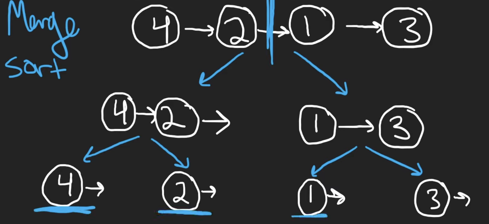
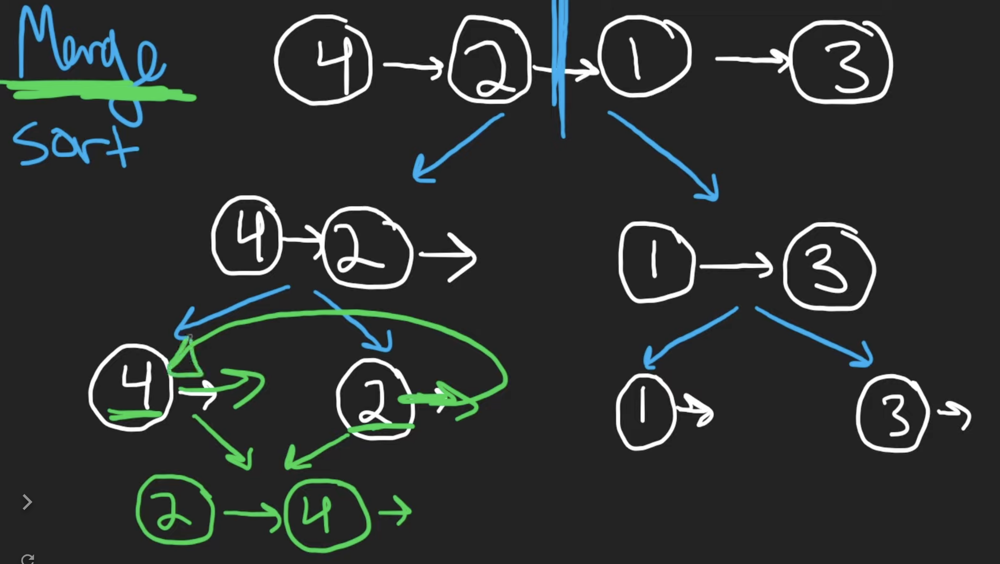

# 148. Sort List

## Description

Given the `head` of a linked list, return the list after sorting it in ascending order.

## Constraints

Sort this linked list in `O(nlogn)` time and O(1) memory.

The number of nodes in the list is in the range `[0, 5 * 104]`.

`-105 <= Node.val <= 105`

## Approach 1 (Time Limit Exceeded)

```python
# python3

# time complexity: O(n^2)
# space complexity: O(1)

# Definition for singly-linked list.
# class ListNode:
#     def __init__(self, val=0, next=None):
#         self.val = val
#         self.next = next
class Solution:
    def insert(self, sortedHead, node):
        """
        insert the new node in sorted linked list
        """
        prev = sortedHead
        p = sortedHead.next

        # find the node in sorted list which is just larger than the input node
        while p != None and p.val <= node.val:
            p = p.next
            prev = prev.next

        node.next = p
        prev.next = node


    def sortList(self, head: Optional[ListNode]) -> Optional[ListNode]:

        # the dummy head of the sorted linked list
        sortedHead = ListNode()

        # iterate through the linked list
        # insert each node in the sorted linked list
        p = head
        while p:
            next = p.next
            self.insert(sortedHead, p)
            p = next

        return sortedHead.next
```

## Approach 2: Merge Sort

<br/>
<br/>
<br/>

<br/>
<br/>

### Explaination of Time Complexity

- The number of times we spliting our linked list was `logn`.
  - That's mathematically log, we divide a number `n` by two until we get the base case `n=1`.
- The number of times you have to merge to take a single node in order to get a resulting linked list was also `logn`.
- The time complexity of merging two lists is `n`.

<br/>

```python
# python3

# time complexity: O(nlogn)
# space comlexity: O(1)

# Definition for singly-linked list.
# class ListNode:
#     def __init__(self, val=0, next=None):
#         self.val = val
#         self.next = next
class Solution:
    def getMid(self, head) -> Optional[ListNode]:

        # head -> 1 -> 2 -> 3 -> 4 : return 2
        # head -> 1 -> 2 -> 3 : return 2

        slow, fast = head, head.next

        while fast and fast.next:
            slow = slow.next
            fast = fast.next.next

        return slow


    def merge(self, left, right) -> Optional[ListNode]:

        tail = dummy = ListNode()

        # iterate through two lists
        # add the smaller one to the merge sorted linked list
        while left and right:
            if left.val < right.val:
                tail.next = left
                left = left.next
            else:
                tail.next = right
                right = right.next

            tail = tail.next

        # once the loop stop executing
        # at least one of pointer(left, right) has become None
        # the other pointer is not None meaning there's still elements for us to add
        if left:
            tail.next = left
        if right:
            tail.next = right

        return dummy.next


    def sortList(self, head: Optional[ListNode]) -> Optional[ListNode]:

        # base case: the linked list has no node or only has one node
        if not head or not head.next:
            return head
        
        # split the list into two halfs
        # set the left pointer points at the first half
        left = head
        right = self.getMid(head)
        rightNext = right.next
        right.next = None
        # set the right pointer points at the second half
        right = rightNext

        left = self.sortList(left)
        right = self.sortList(right)

        return self.merge(left, right)
```