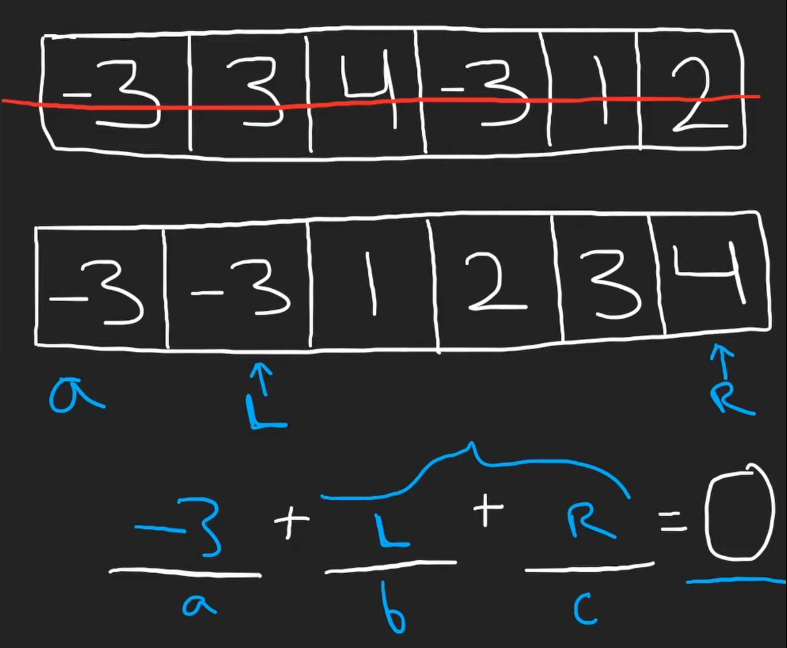
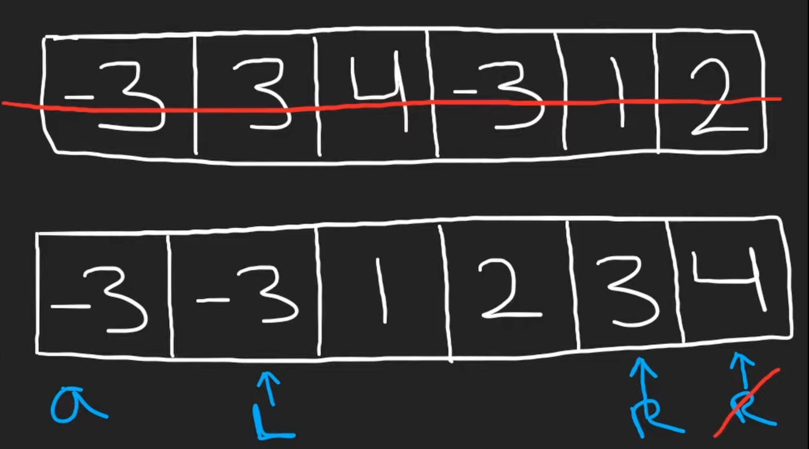

# 15. 3Sum

## Description

Given an integer arrays nums.

return all the triplets `[nums[i]`, `nums[j]`, `nums[k]]` such that `i != j`, `i != k`, and `j != k`, and `nums[i] + nums[j] + nums[k] == 0`.

The return set muust not contain duplicated triples.

## Approach

<br/>
<br/>

<br/>
<br/>

```python
# python3

# time complexity: O(n^2)
# space complexity: intuitively O(n), but depends on the sort algorithm

class Solution:
    def threeSum(self, nums: List[int]) -> List[List[int]]:

        ans = []

        # once we choose a number and put it in the first position
        # the remain part of the problem reduces to two sum problem

        nums.sort()
        n = len(nums)

        # the first loop
        # use each number in the input array as our possible first value
        # so iterate through the index and value
        for i, num in enumerate(nums):

            # we don't wanna reuse the same value in the first position
            # so if the input list has duplicated number, we use the first occured number
            if  i > 0 and num == nums[i - 1]:
                continue

            # the remain problem becomes the Two Sum problem
            # initialize two pointers
            left, right = i + 1, n - 1

            # the second loop
            # we don't need to worry the 'out of index' problem
            # the right pointer would never exceeds
            # if the left pointer exceed, it won't satisfy the 'left < right'
            while left < right:

                if nums[left] + nums[right] + num == 0:
                    ans.append([num, nums[left], nums[right]])
                    left += 1
                    # we don't want to the same sum
                    # if the left is the same as before, keep updating it
                    while nums[left] == nums[left - 1] and left < right:
                        left += 1

                elif nums[left] + nums[right] < -num:
                    # move the left
                    left += 1
                else:
                    # move the right
                    right -= 1
                
        return ans
```