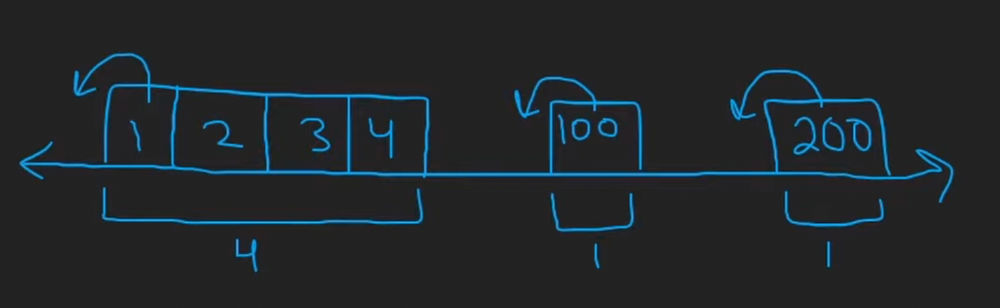
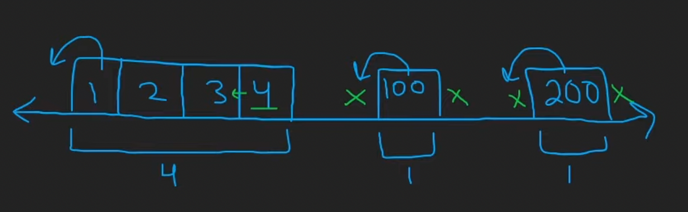

# 128. Longest Consecutive Sequence

## Description

Given an unsorted array of integers `nums`, return the length of the longest consecutive elements sequence.

## Constraints

- You must write an algorithm that runs in O(n) time.
- `0 <= nums.length <= 10^5`
- `-10^9 <= nums[i] <= 10^9`

## Approach

<br/>
<br/>

<br/>
<br/>

```python
# python3

# time complexity: O(n)
# space complexity: O(n), we only visit each number at most twice.

class Solution:
    def longestConsecutive(self, nums: List[int]) -> int:
        longest = 0

        hashmap = set(nums)

        for num in nums:
            # check if it is the start of a sequence
            # the start of a sequence is the number which has no left neighbour
            if (num - 1) not in hashmap:
                length = 1
                while (num + length) in hashmap:
                    length += 1
                longest = max(longest, length)

        return longest
```